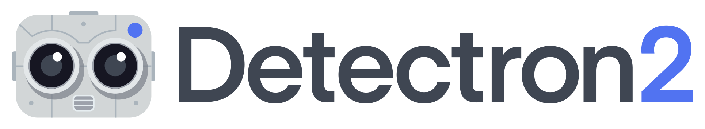

Detectron2 is Facebook AI Research's next generation software system
that implements state-of-the-art object detection algorithms.
It is a ground-up rewrite of the previous version,
[Detectron](https://github.com/facebookresearch/Detectron/),
and it originates from [maskrcnn-benchmark](https://github.com/facebookresearch/maskrcnn-benchmark/).
It is written in Python and powered by the [PyTorch](https://pytorch.org) deep
learning framework.

<div align="center">
  
</div>


## Installation

See [INSTALL.md](INSTALL.md).

## Quick Start

See [GETTING_STARTED.md](GETTING_STARTED.md), or our [Colab Notebook](TODO).


## Model Zoo and Baselines

We provide a large set of baseline results and trained models available for download in the [Detectron2 Model Zoo](MODEL_ZOO.md).


## License

Detectron2 is released under the [Apache 2.0 license](LICENSE).

## Citing Detectron

If you use Detectron2 in your research or wish to refer to the baseline results published in the [Model Zoo](MODEL_ZOO.md), please use the following BibTeX entry.

```
@misc{wu2019detectron2,
  author =       {Yuxin Wu and Alexander Kirillov and Francisco Massa and
                  Wan-Yen Lo and Ross Girshick},
  title =        {Detectron2},
  howpublished = {\url{https://github.com/facebookresearch/detectron2}},
  year =         {2019}
}
```
