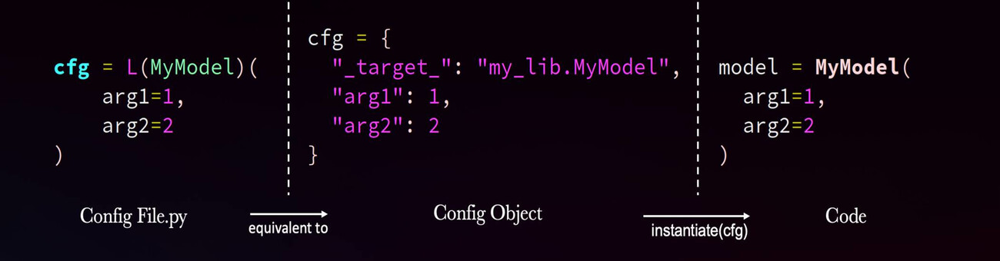

# Lazy Configs

The traditional yacs-based config system provides basic, standard functionalities.
However, it does not offer enough flexibility for many new projects.
We develop an alternative, non-intrusive config system that can be used with
detectron2 or potentially any other complex projects.

## Python Syntax

Our config objects are still dictionaries. Instead of using Yaml to define dictionaries,
we create dictionaries in Python directly. This gives users the following power that
doesn't exist in Yaml:

* Easily manipulate the dictionary (addition & deletion) using Python.
* Write simple arithmetics or call simple functions.
* Use more data types / objects.
* Import / compose other config files, using the familiar Python import syntax.

A Python config file can be loaded like this:
```python
# config.py:
a = dict(x=1, y=2, z=dict(xx=1))
b = dict(x=3, y=4)

# my_code.py:
from detectron2.config import LazyConfig
cfg = LazyConfig.load("path/to/config.py")  # an omegaconf dictionary
assert cfg.a.z.xx == 1
```

After [LazyConfig.load](../modules/config.html#detectron2.config.LazyConfig.load), `cfg` will be a dictionary that contains all dictionaries
defined in the global scope of the config file. Note that:
* All dictionaries are turned to an [omegaconf](https://omegaconf.readthedocs.io/)
  config object during loading. This enables access to omegaconf features,
  such as its [access syntax](https://omegaconf.readthedocs.io/en/2.1_branch/usage.html#access-and-manipulation)
  and [interoplation](https://omegaconf.readthedocs.io/en/2.1_branch/usage.html#variable-interpolation).
* Absolute imports in `config.py` works the same as in regular Python.
* Relative imports can only import dictionaries from config files.
  They are simply a syntax sugar for [LazyConfig.load_rel](../modules/config.html#detectron2.config.LazyConfig.load_rel).
  They can load Python files at relative path without requiring `__init__.py`.

[LazyConfig.save](../modules/config.html#detectron2.config.LazyConfig.save) can save a config object to yaml.
Note that this is not always successful if non-serializable objects appear in the config file (e.g. lambdas).
It is up to users whether to sacrifice the ability to save in exchange for flexibility.

## Recursive Instantiation

The LazyConfig system heavily uses recursive instantiation, which is a pattern that
uses a dictionary to describe a
call to a function/class. The dictionary consists of:

1. A "\_target\_" key which contains path to the callable, such as "module.submodule.class_name".
2. Other keys that represent arguments to pass to the callable. Arguments themselves can be defined
   using recursive instantiation.

We provide a helper function [LazyCall](../modules/config.html#detectron2.config.LazyCall) that helps create such dictionaries.
The following code using `LazyCall`
```python
from detectron2.config import LazyCall as L
from my_app import Trainer, Optimizer
cfg = L(Trainer)(
  optimizer=L(Optimizer)(
    lr=0.01,
    algo="SGD"
  )
)
```
creates a dictionary like this:
```
cfg = {
  "_target_": "my_app.Trainer",
  "optimizer": {
    "_target_": "my_app.Optimizer",
    "lr": 0.01, "algo": "SGD"
  }
}
```

By representing objects using such dictionaries, a general
[instantiate](../modules/config.html#detectron2.config.instantiate)
function can turn them into actual objects, i.e.:
```python
from detectron2.config import instantiate
trainer = instantiate(cfg)
# equivalent to:
# from my_app import Trainer, Optimizer
# trainer = Trainer(optimizer=Optimizer(lr=0.01, algo="SGD"))
```

This pattern is powerful enough to describe very complex objects, e.g.:

 <details>
 <summary>
A Full Mask R-CNN described in recursive instantiation (click to expand)
 </summary>

```eval_rst
.. literalinclude:: ../../configs/common/models/mask_rcnn_fpn.py
  :language: python
  :linenos:
```

 </details>

There are also objects or logic that cannot be described simply by a dictionary,
such as reused objects or method calls. They may require some refactoring
to work with recursive instantiation.

## Using Model Zoo LazyConfigs

We provide some configs in the model zoo using the LazyConfig system, for example:

* [common baselines](../../configs/common/).
* [new Mask R-CNN baselines](../../configs/new_baselines/)

After installing detectron2, they can be loaded by the model zoo API
[model_zoo.get_config](../modules/model_zoo.html#detectron2.model_zoo.get_config).

Using these as references, you're free to define custom config structure / fields for your own
project, as long as your training script can understand them.
Despite of this, our model zoo configs still follow some simple conventions for consistency, e.g.
`cfg.model` defines a model object, `cfg.dataloader.{train,test}` defines dataloader objects,
and `cfg.train` contains training options in key-value form.
In addition to `print()`, a better way to view the structure of a config is like this:
```
from detectron2.model_zoo import get_config
from detectron2.config import LazyConfig
print(LazyConfig.to_py(get_config("COCO-InstanceSegmentation/mask_rcnn_R_50_FPN_1x.py")))
```
From the output it's easier to find relevant options to change, e.g.
`dataloader.train.total_batch_size` for the batch size, or `optimizer.lr` for base learning rate.

We provide a reference training script
[tools/lazyconfig_train_net.py](../../tools/lazyconfig_train_net.py),
that can train/eval our model zoo configs.
It also shows how to support command line value overrides.

To demonstrate the power and flexibility of the new system, we show that
[a simple config file](../../configs/Misc/torchvision_imagenet_R_50.py)
can let detectron2 train an ImageNet classification model from torchvision, even though
detectron2 contains no features about ImageNet classification.
This can serve as a reference for using detectron2 in other deep learning tasks.

## Summary

By using recursive instantiation to create objects,
we avoid passing a giant config to many places, because `cfg` is only passed to `instantiate`.
This has the following benefits:

* It's __non-intrusive__: objects to be constructed are config-agnostic, regular Python
  functions/classes.
  They can even live in other libraries. For example,
  `{"_target_": "torch.nn.Conv2d", "in_channels": 10, "out_channels": 10, "kernel_size": 1}`
  defines a conv layer.
* __Clarity__ of what function/classes will be called, and what arguments they use.
* `cfg` doesn't need pre-defined keys and structures. It's valid as long as it translates to valid
  code. This gives a lot more __flexibility__.
* You can still pass huge dictionaries as arguments, just like the old way.

Recursive instantiation and Python syntax are orthogonal: you can use one without the other.
But by putting them together, the config file looks a lot like the code that will be executed:



However, the config file just defines dictionaries, which can be easily manipulated further
by composition or overrides.
The corresponding code will only be executed
later when `instantiate` is called. In some way,
in config files we're writing "editable code" that will be "lazily executed" later when needed.
That's why we call this system "LazyConfig".
