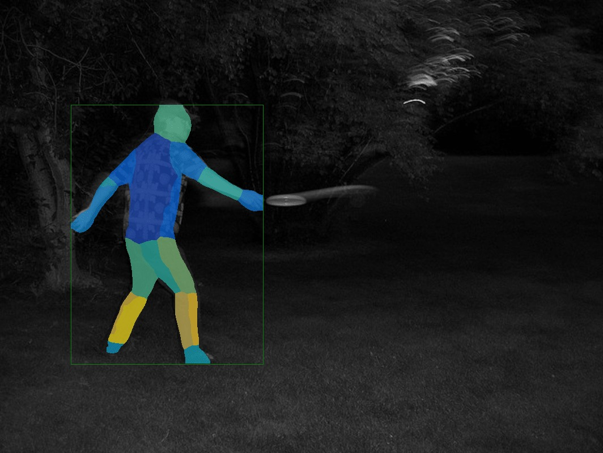
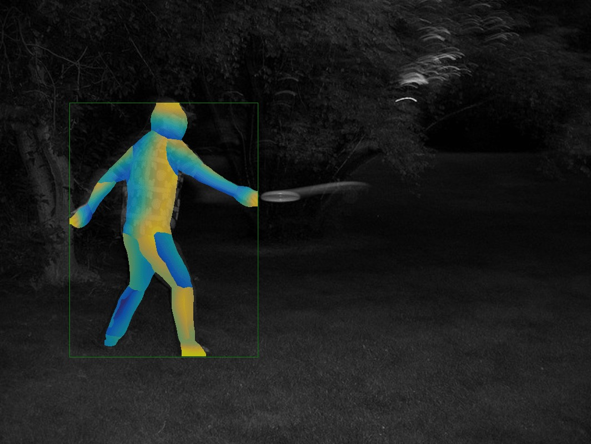

# Apply Net

`apply_net` is a tool to print or visualize DensePose results on a set of images.
It has two modes: `dump` to save DensePose model results to a pickle file
and `show` to visualize them on images.

## Dump Mode

The general command form is:
```bash
python apply_net.py dump [-h] [-v] [--output <dump_file>] <config> <model> <input>
```

There are three mandatory arguments:
 - `<config>`, configuration file for a given model;
 - `<model>`, model file with trained parameters
 - `<input>`, input image file name, pattern or folder

One can additionally provide `--output` argument to define the output file name,
which defaults to `output.pkl`.


Examples:

1. Dump results of a DensePose model with ResNet-50 FPN backbone for images
   in a folder `images` to file `dump.pkl`:
```bash
python apply_net.py dump configs/densepose_rcnn_R_50_FPN_s1x.yaml DensePose_ResNet50_FPN_s1x-e2e.pkl images --output dump.pkl -v
```

2. Dump results of a DensePose model with ResNet-50 FPN backbone for images
   with file name matching a pattern `image*.jpg` to file `results.pkl`:
```bash
python apply_net.py dump configs/densepose_rcnn_R_50_FPN_s1x.yaml DensePose_ResNet50_FPN_s1x-e2e.pkl "image*.jpg" --output results.pkl -v
```


## Visualization Mode

The general command form is:
```bash
python apply_net.py show [-h] [-v] [--min_score <score>] [--nms_thresh <threshold>] [--output <image_file>] <config> <model> <input> <visualizations>
```

There are four mandatory arguments:
 - `<config>`, configuration file for a given model;
 - `<model>`, model file with trained parameters
 - `<input>`, input image file name, pattern or folder
 - `<visualizations>`, visualizations specifier; currently available visualizations are:
   * `bbox` - bounding boxes of detected persons;
   * `dp_segm` - segmentation masks for detected persons;
   * `dp_u` - each body part is colored according to the estimated values of the
     U coordinate in part parameterization;
   * `dp_v` - each body part is colored according to the estimated values of the
     V coordinate in part parameterization;
   * `dp_contour` - plots contours with color-coded U and V coordinates


One can additionally provide the following optional arguments:
 - `--min_score` to only show detections with sufficient scores that are not lower than provided value
 - `--nms_thresh` to additionally apply non-maximum suppression to detections at a given threshold
 - `--output` to define visualization file name template, which defaults to `output.png`.
   To distinguish output file names for different images, the tool appends 1-based entry index,
   e.g. output.0001.png, output.0002.png, etc...


The following examples show how to output results of a DensePose model
with ResNet-50 FPN backbone using different visualizations for image `image.jpg`:

1. Show bounding box and segmentation:
```bash
python apply_net.py show configs/densepose_rcnn_R_50_FPN_s1x.yaml DensePose_ResNet50_FPN_s1x-e2e.pkl image.jpg bbox,dp_segm -v
```


2. Show bounding box and estimated U coordinates for body parts:
```bash
python apply_net.py show configs/densepose_rcnn_R_50_FPN_s1x.yaml DensePose_ResNet50_FPN_s1x-e2e.pkl image.jpg bbox,dp_u -v
```


3. Show bounding box and estimated V coordinates for body parts:
```bash
python apply_net.py show configs/densepose_rcnn_R_50_FPN_s1x.yaml DensePose_ResNet50_FPN_s1x-e2e.pkl image.jpg bbox,dp_v -v
```


4. Show bounding box and estimated U and V coordinates via contour plots:
```bash
python apply_net.py show configs/densepose_rcnn_R_50_FPN_s1x.yaml DensePose_ResNet50_FPN_s1x-e2e.pkl image.jpg dp_contour,bbox -v
```

